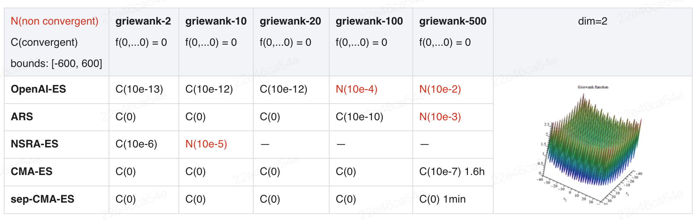

## Examples
Examples and results of five algorithms on the two built-in problems.
### Benchmark result
+ Experiment result of different algorithms on two mathematical functions (Ackley and Griewank), five kinds of dimensions are selected for comparison

    <p align="center">
    
    </p>
    <p align="center">
    
    </p>       

    Note: 1. Non-convergent does not mean that it cannot converge, but hyperparameters need additional adjustment. 2. At dim=500, the difficulty of the problem increases, and we increase the sample_num convergence (sample_num=200 for ARS, sample_num=500 for CMAES and Sep-CMAES).  

+ Results of five algorithms in two reinforcement learning environments (HalfCheetah-v5 and Humanoid-v5). (model network for optimization)

    <p align="center">
    
    </p>

    Note: In Humanoid-v5, there are two algorithms are absent in comparative experiments. With the high dimensions of observation space and action space of the environment,  calculating `bc` is hard for NSRAES, and it cost a long time for CMAES sampling (about 1-2 minutes for single sampling).

## How to use
### Local training for function problems
First, enter [examples](../examples) directory, then try to run task to reproduce the above experimental results according to the following guidelines.
```bash
cd examples
```

### Function problems (local training)
Two Methods are provided for function problems. (e.g. solve 2D ackley function by CMA-ES).
- Method 1. Directly optimize the input of the function, start local training
    ```bash
    python run_function.py --config_file ./tuned_configs/cmaes_function.ymal
    ```
- Method 2. By optimizing a single-layer model network with a fixed input of 1 (the output of the model is the input of the function)
    ```bash
    python run_function_model.py --config_file ./tuned_configs/cmaes_function_model.ymal
    ```

### RL problems (distributed training)
In RL environments, we provide examples which will directly optimize policy model (e.g. solve the HalfCheetah-v5 with OpenAI-ES).  
Before starting training, please use [ray](https://docs.ray.io/en/latest/ray-core/starting-ray.html#starting-ray-via-the-cli-ray-start) to create a cluster.

```bash
# create a cluster
ray start --head --num-cpus 50 --port 6379

# start training
python run_mujoco.py --config_file ./tuned_configs/openaies_mujoco.ymal
```
For configuration of the remaining algorithms and problems, see [tuned_config](./tuned_configs).
