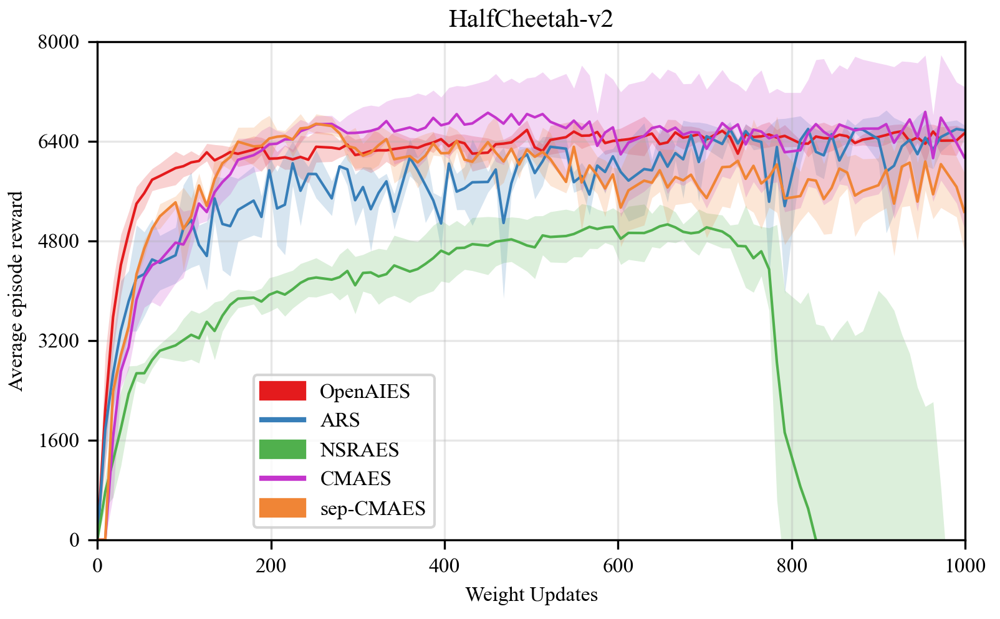

## 示例
五个算法在内置的两大问题上的示例及结果展示。
### 实验结果
+ 四个算法在两个数学函数（Ackley 和 Griewank）的五个维度（2，10，20，100，500）上的实验结果。（直接优化浮点型列表，即数学函数的输入）

    <p align="center">
    
    </p>
    <p align="center">
    
    </p>       

    提示：在 dim=500 时，问题难度升级，我们加大了 sample_num 以达到收敛效果（ARS的 sample_num=200，CMAES和Sep-CMAES的 sample_num=500）。  
 
+ 五个算法在两个强化学习环境（HalfCheetah-v2 和 Humanoid-v2）中的实验结果。（直接优化策略模型）

    <p align="center">
    
    </p>
 
    提示：在 Humanoid-v2 环境中有两个算法不做对比实验，因观察空间和动作空间维度较大，NSRAES算法难以计算bc，CMAES采样算法开销太大（采样一次需要1-2分钟）。


## 如何使用
首先进入[examples](http://gitlab.baidu.com/nlp-ol/ESBox/tree/developing/examples)文件夹，根据以下指引复现上述实验结果   
```bash
cd examples
```

### 数学函数问题（本地训练)
对于数学函数问题，本示例提供了两种不同的解决方式（以 CMA-ES 算法解决二维 ackley 函数为例）。
- 方式1. 直接优化函数的输入，启动本地训练
    ```bash
    python run_function.py --config_file ./tuned_configs/cmaes_function.ymal
    ```
- 方式2. 通过优化固定输入为 1 的 单层模型网络（该模型的输出为数学函数的输入）
    ```bash
    python run_function_model.py --config_file ./tuned_configs/cmaes_function_model.ymal
    ```

### 强化学习问题（分布式训练）
对于强化学习环境，我们提供了直接优化策略模型的示例（以 OpenAI-ES 算法解决 HalfCheetah-v2 问题为例）。
启动训练前，请先使用[xparl](https://parl.readthedocs.io/en/latest/parallel_training/setup.html)创建集群。参考[文档](https://parl.readthedocs.io/en/latest/parallel_training/setup.html)获取更多关于集群的信息。

```bash
# 创建集群
xparl start --port 8010 --cpu_num 50

# 启动训练
python run_mujoco.py --config_file ./tuned_configs/openaies_mujoco.ymal
```
其余的算法和问题对应的 config 详见 [tuned_config](http://gitlab.baidu.com/nlp-ol/ESBox/tree/developing/examples/tuned_configs)。
